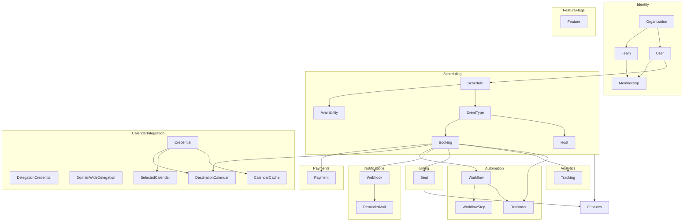
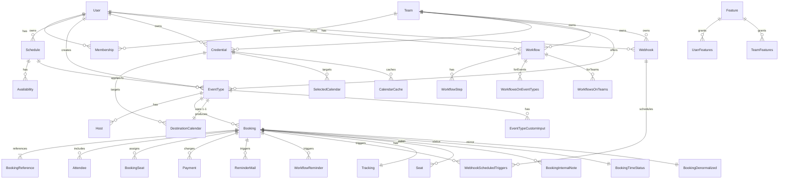

# infra-db

Shared schema and Drizzle ORM layer used across all contexts in `cal.com.alt`.

- Uses **Postgres** in production
- Uses **PGlite** for local development (file) and testing (in-memory)
- Repositories in infra layer to map domain entities to the existing `cal.com` tables.

---

## Context p

| Context                  | Type                | Entities / Domain Objects                                                                                    | Depends on / Publishes to                                                                                          |
| ------------------------ | ------------------- | ------------------------------------------------------------------------------------------------------------ | ------------------------------------------------------------------------------------------------------------------ |
| **Identity & Access**    | Supporting          | User, Team, Organization, Membership, Auth Token, Profile                                                    | Referenced by every other context                                                                                  |
| **Scheduling**           | Core domain         | Schedule, Availability, EventType, Booking, Host                                                             | Depends on Identity & Calendar Integration Publishes to Payments, Notifications, Automation, Billing, Analytics |
| **Calendar Integration** | Generic integration | Credential, DelegationCredential, DomainWideDelegation, DestinationCalendar, SelectedCalendar, CalendarCache | Called synchronously by Scheduling                                                                                 |
| **Payments**             | Generic integration | Payment                                                                                                      | Listens to Booking events from Scheduling                                                                          |
| **Automation**           | Supporting          | Workflow, WorkflowStep, Reminder, AIPhoneCallConfiguration                                                   | Subscribes to Scheduling & Notifications                                                                           |
| **Notifications**        | Generic             | Webhook, ReminderMail, WebhookScheduledTriggers                                                              | Listens to Scheduling & Automation                                                                                 |
| **Billing / Seats**      | Supporting          | Seat                                                                                                         | Consulted by Scheduling May react to Payments                                                                   |
| **FeatureFlags**         | Supporting          | Feature, TeamFeatures, UserFeatures                                                                          | Consulted by Billing and Scheduling for entitlement & gradual rollout                                              |
| **Analytics**            | Reporting           | Tracking                                                                                                     | Event‑driven read‑models fed by Scheduling                                                                         |

Dependency graph

---

## Context-based schema breakdown

### Identity & Access (`identity-tables.ts`)

| Table                | PK · FK(s)                                                           | Enums / Types    |
| -------------------- | -------------------------------------------------------------------- | ---------------- |
| User                 | **id** organizationId → Team.id                                   | IdentityProvider |
| Team                 | **id** parentId → Team.id                                         | –                |
| Membership           | **id** userId → User.id teamId → Team.id                       | MembershipRole   |
| OrganizationSettings | **id** organizationId → Team.id                                   | SMSLockState     |
| Profile              | **id** userId → User.id organizationId → Team.id               | –                |
| UserPassword         | **userId** userId → User.id                                       | –                |
| Session              | **id** userId → User.id                                           | –                |
| Account              | **id** userId → User.id                                           | –                |
| Impersonations       | **id** impersonatedUserId → User.id impersonatedById → User.id | –                |
| ApiKey               | **id** userId → User.id                                           | –                |
| AccessToken          | **id** userId → User.id                                           | –                |
| RefreshToken         | **id** userId → User.id                                           | –                |
| ResetPasswordRequest | **id** userId → User.id                                           | –                |

### Scheduling (`scheduling-tables.ts`)

| Table                         | PK · FK(s)                                                                                                 | Enums / Types              |
| ----------------------------- | ---------------------------------------------------------------------------------------------------------- | -------------------------- |
| Schedule                      | **id** userId → User.id                                                                                 | –                          |
| Availability                  | **id** userId → User.id eventTypeId → EventType.id scheduleId → Schedule.id                       | –                          |
| EventType                     | **id** userId → User.id teamId → Team.id scheduleId → Schedule.id                                 | SchedulingType, PeriodType |
| Host                          | **(userId,eventTypeId)** userId → User.id eventTypeId → EventType.id                                 | –                          |
| Booking                       | **id** userId → User.id eventTypeId → EventType.id destinationCalendarId → DestinationCalendar.id | BookingStatus              |
| BookingReference              | **id** bookingId → Booking.id                                                                           | –                          |
| Attendee                      | **id** bookingId → Booking.id                                                                           | –                          |
| BookingSeat                   | **id** bookingId → Booking.id attendeeId → Attendee.id                                               | –                          |
| EventTypeCustomInput          | **id** eventTypeId → EventType.id                                                                       | EventTypeCustomInputType   |
| ReminderMail                  | **id** referenceId → Booking.id                                                                         | ReminderType               |
| HashedLink                    | **id** eventTypeId → EventType.id                                                                       | –                          |
| SelectedSlots                 | **id** userId → User.id                                                                                 | –                          |
| BookingInternalNote           | **id** bookingId → Booking.id                                                                           | –                          |
| OutOfOfficeEntry              | **id** userId → User.id                                                                                 | –                          |
| OutOfOfficeReason             | **id** userId → User.id                                                                                 | –                          |
| BookingTimeStatus             | **id** bookingId → Booking.id                                                                           | –                          |
| BookingDenormalized           | **id**                                                                                                     | –                          |
| BookingTimeStatusDenormalized | **id**                                                                                                     | –                          |

### Calendar Integration (`calendar-integration-tables.ts`)

| Table                | PK · FK(s)                                                                               | Enums / Types |
| -------------------- | ---------------------------------------------------------------------------------------- | ------------- |
| Credential           | **id** userId → User.id teamId → Team.id                                           | –             |
| DelegationCredential | **id** userId → User.id organizationId → Team.id                                   | –             |
| DomainWideDelegation | **id** organizationId → Team.id                                                       | –             |
| DestinationCalendar  | **id** userId → User.id eventTypeId → EventType.id credentialId → Credential.id | –             |
| SelectedCalendar     | **id** userId → User.id credentialId → Credential.id eventTypeId → EventType.id | –             |
| CalendarCache        | **(credentialId,key)** credentialId → Credential.id                                   | –             |

### Payments

| Table   | PK · FK(s)                       | Enums / Types |
| ------- | -------------------------------- | ------------- |
| Payment | **id** bookingId → Booking.id | PaymentOption |

### Automation

| Table                    | PK · FK(s)                                                             | Enums / Types                                       |
| ------------------------ | ---------------------------------------------------------------------- | --------------------------------------------------- |
| Workflow                 | **id** userId → User.id teamId → Team.id                         | WorkflowTriggerEvents                               |
| WorkflowStep             | **id** workflowId → Workflow.id                                     | WorkflowActions, WorkflowTemplates, WorkflowMethods |
| WorkflowsOnEventTypes    | **id** workflowId → Workflow.id eventTypeId → EventType.id       | –                                                   |
| WorkflowsOnTeams         | **id** workflowId → Workflow.id teamId → Team.id                 | –                                                   |
| WorkflowReminder         | **id** bookingUid → Booking.uid workflowStepId → WorkflowStep.id | TimeUnit                                            |
| AIPhoneCallConfiguration | **id** eventTypeId → EventType.id                                   | –                                                   |

### Notifications

| Table                    | PK · FK(s)                                                                   | Enums / Types        |
| ------------------------ | ---------------------------------------------------------------------------- | -------------------- |
| Webhook                  | **id** userId → User.id teamId → Team.id eventTypeId → EventType.id | WebhookTriggerEvents |
| WebhookScheduledTriggers | **id** webhookId → Webhook.id bookingId → Booking.id                   | –                    |
| ReminderMail             | **id** referenceId → Booking.id                                           | ReminderType         |

### Billing / Seats

| Table | PK · FK(s)                                    | Enums / Types |
| ----- | --------------------------------------------- | ------------- |
| Seat  | **id** orgId → Team.id userId → User.id | –             |

### Feature (`feature-tables.ts`)

| Table        | PK · FK(s)                                 | Enums / Types |
| ------------ | ------------------------------------------ | ------------- |
| Feature      | **slug**                                   | FeatureType   |
| UserFeatures | **(userId,featureId)** userId → User.id | –             |
| TeamFeatures | **(teamId,featureId)** teamId → Team.id | –             |

### Analytics

| Table    | PK · FK(s)                       | Enums / Types |
| -------- | -------------------------------- | ------------- |
| Tracking | **id** bookingId → Booking.id | –             |

Entity–relationship diagram

